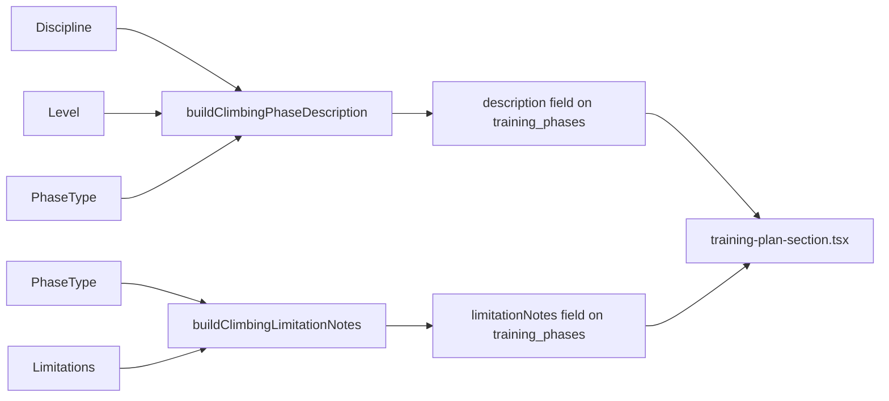

# Feature Specification: Climbing Phase Content Upgrade

**Spec ID**: `climbing-phase-content-upgrade`
**Created**: 2026-03-14
**Status**: Built (complete)
**Author**: Climbing Agent
**Depends on**: Climbing Training Periodization V1 (built), Tennis Periodization V1 (built -- used as reference implementation)

> "The tennis agent built rich, multi-section phase descriptions with drill specifics, supplemental training, mental game exercises, and physical limitation notes. The climbing agent has one generic paragraph per phase. Let's fix that."

---

## Problem

The climbing training plan's phase descriptions are short, generic, and tell the user *what* the phase is about but not *what to actually do*. Compare:

**Climbing (current):**
> High-volume climbing at submaximal intensity (0.5–2 grades below max). Focus on technique, movement economy, and route-reading. Include basic conditioning (core, antagonist work). No projecting.

**Tennis (current):**
> ON-COURT FOCUS
> Work on the transition game: approach shot placement followed by net coverage. Hit approach shots to the opponent's weaker side, then close to the net. Practice the footwork sequence: hit approach → split step at the service line → react to the passing shot...
>
> SUPPLEMENTAL TRAINING
> Core stability (planks, side planks, dead bugs, bird dogs), shoulder prehab (external rotation with band...), lower body basics (eccentric calf raises, single-leg balance, bodyweight squats)...
>
> MENTAL GAME
> Inner Game — Nonjudgmental awareness: During practice, notice where the ball goes without labeling shots as "good" or "bad"...

The tennis description is actionable. The climbing description is not.

---

## Solution

Mirror the tennis agent's approach: replace the flat `PHASE_DESCRIPTIONS` record with a structured `PHASE_CONTENT` object and a `buildClimbingPhaseDescription()` function that assembles multi-section descriptions from:

1. **CLIMBING FOCUS** -- discipline-specific (bouldering vs sport), level-specific wall drills and session targets
2. **SUPPLEMENTAL TRAINING** -- level-specific exercises with sets/reps, antagonist work, prehab
3. **MENTAL TRAINING** -- phase-specific mental exercises grounded in Hörst's Mental Wings framework
4. **Physical limitation notes** (optional) -- per-limitation, per-phase injury prevention notes

All content is sourced from the three books in the `Climbing/` folder.

---

## Architecture

No new tables, no new API routes, no UI changes. The `training-plan-section.tsx` component already renders multi-line `description` text and `limitationNotes` in an amber box. The only change is in the periodization engine.

### Current code pattern (climbing)

```typescript
// periodization.ts
const PHASE_DESCRIPTIONS: Record<PhaseType, string> = {
  "skill-stamina": "High-volume climbing at submaximal...",
  // ...
};

// Used directly in generatePhases():
description: PHASE_DESCRIPTIONS[t.type],
```

### Target code pattern (matching tennis)

```typescript
// periodization.ts
interface ClimbingPhaseContent {
  climbing: Record<Discipline, string>;
  climbingBeginner?: string;
  supplemental: string;
  supplementalBeginner?: string;
  mentalGame: string;  // named to match tennis PhaseContent field
}

const PHASE_CONTENT: Record<PhaseType, ClimbingPhaseContent> = { ... };

export function buildClimbingPhaseDescription(
  phaseType: PhaseType,
  discipline: Discipline,
  level: ClimberLevel
): string { ... }

// Physical limitations
const CLIMBING_LIMITATION_NOTES: Record<ClimbingLimitation, Record<string, string>> = { ... };

export function buildClimbingLimitationNotes(
  phaseType: PhaseType,
  limitations: ClimbingLimitation[]
): string | null { ... }
```

### Data flow



---

## Phase Content (Full Text)

### Skill & Stamina Phase

#### CLIMBING FOCUS

**Bouldering:**
Climb at your max grade minus 2 for volume. Target 20-30 problems per session, all clean. Focus on three technique pillars: (1) silent feet -- place each foot deliberately with zero noise on the hold, (2) hip positioning -- keep your hips close to the wall and rotate into each reach, (3) reading -- study every problem for 30 seconds before touching the wall. No projecting: if a problem takes more than 3 attempts, move on. Practice slow-motion climbing at half speed for at least 15 minutes per session -- exaggerate every body position and notice where your weight is.

**Sport climbing:**
Route volume is king. Climb 6-10 routes per session at 1-2 grades below your redpoint max. Every route should be an onsight or flash attempt -- read the route from the ground, plan rest positions, and commit to your sequence. Practice clipping efficiency: clip at chest height, not above your head (wastes energy and puts you in a weak position). On rest holds, practice the shake-out technique: drop one arm, shake it below your hip, breathe out fully, and count to 10 before switching arms. Include at least one sustained route per session that keeps you on the wall for 5+ minutes without rest.

**Beginner override:**
Climb everything. Do not limit yourself to one style. Climb 15-20 easy routes or problems per session at a grade where you can complete them all without falling. Focus entirely on footwork: look at your feet, place them precisely, and trust them. No campus-style pulling -- if your feet cut, you're using too much upper body. Practice traversing at the end of each session: 5-10 minutes of continuous lateral movement without stepping off the wall. This builds stamina and footwork simultaneously.

#### SUPPLEMENTAL TRAINING

Core stability (hollow body holds 3x30sec, plank variations 3x45sec, hanging leg raises 3x10), antagonist work (push-ups 3x15, wrist extensions 3x20, reverse flys 3x12, external shoulder rotations 3x15/arm). Antagonist work is not optional -- it prevents the muscle imbalances that cause shoulder impingement and golfer's elbow. The pulling-to-pushing ratio in climbing is heavily skewed; if you do not actively counterbalance it, injury is a matter of when, not if (Hörst, Ch. 6). Minimum 2x/week, ideally at the end of each climbing session.

**Beginner override:**
Same exercises, 2 sets instead of 3, bodyweight only. Add basic pull-ups if you can do fewer than 5: hang from a bar and do slow negatives (3-second lowering) for 3x3. Do not use a fingerboard -- your tendons need 1-2 years of climbing-specific loading before they can handle isolated finger training safely (Tkacz, "Avoid hangboard before V3-V5").

#### MENTAL TRAINING

Separate your self-image from your climbing performance (Hörst, Mental Wings #1). When you fall off a problem, observe it without judgment: "I fell on move 7 because my foot slipped" not "I'm weak" or "I suck." This is the foundation of the performance mindset -- you are gathering data, not passing verdicts. Practice the 60-second visualization exercise before your hardest attempt: close your eyes, replay your best send in vivid detail -- the holds, the sequence, the feeling of sticking the crux. Then open your eyes and climb.

Track your Energy-Emotion state at the start of each session: Energy 0-10, Emotion -5 to +5. Over weeks, you'll notice patterns: what conditions produce your best sessions? What kills your motivation? Write it down. This is Hörst's ANSWER sequence -- Awareness, kNotice, Study, Willing adjustment, Evaluation, Repeat.

---

### Max Strength & Power Phase

#### CLIMBING FOCUS

**Bouldering:**
This is your hardest training phase. Climb at V-max: 2-3 problems at your absolute limit per 30-minute block, with 3-5 minutes of complete rest between attempts. Quality over quantity -- if you're not resting long enough, you're training endurance, not strength. Work one signature weakness: if crimps are your limiter, project crimp-intensive problems. If slopers kill you, find sloper problems. After bouldering, do fingerboard work: repeaters for intermediate (5 grips x 5 hangs x 5 sec, 3 min rest between grips) or max hangs for advanced (3 grips x 3 sets x 5 sec, 5 min rest, add weight when you can hang 8+ seconds).

**Sport climbing:**
Hard bouldering for the first half of the session (same protocol as above). Then practice power moves on routes: find sport routes with distinct crux sequences and rehearse the crux in isolation. Clip-to-clip sections at your limit. The goal is to develop the ability to produce maximal force for 3-5 moves in a row -- the kind of effort that gets you through a route crux. Fingerboard work as above: repeaters (intermediate) or max hangs (advanced).

**Beginner override:**
No fingerboard. No campus board. Hard bouldering only -- pick problems at your limit and try them 3-5 times each with 2-3 minutes rest between attempts. Focus on learning to try hard: pull with full commitment, generate momentum, and be comfortable with falling. This phase teaches effort application, not raw strength.

#### SUPPLEMENTAL TRAINING

Weighted pull-ups (3x5-8, add weight when you hit 8 reps cleanly, 3 min rest), lock-offs or Frenchies (3 sets: pull to top, hold 5 sec, lower to 90 degrees, hold 5 sec, lower to 120 degrees, hold 5 sec, 5 min rest), core power (front lever progressions 3x5-10sec, ab wheel rollouts 3x8-12). Antagonist work continues at 2x/week minimum -- do NOT skip it during the strength phase. Add dips 3x10 to counterbalance the increased pulling volume.

For advanced climbers only: campus board laddering (5 sets of 6-12 hand moves, 5 min rest) or one-arm lock-offs (3 sets of 5-15 sec/arm, 5 min rest). Campus board requires 3+ years of climbing and leading at least 5.11/V5 -- this is non-negotiable for tendon safety (Hörst, Ch. 5). Cycle campus work 2 weeks on, 2 weeks off.

**Beginner override:**
Pull-ups to failure (3 sets, 3 min rest). If you cannot do 5 pull-ups, do slow negatives (3 sec lowering, 3x5). Bodyweight core work only. No weighted exercises, no fingerboard, no campus board.

#### MENTAL TRAINING

Develop a pre-climb ritual (Hörst, Mental Wings #7). Before every serious attempt: (1) chalk up, (2) visualize the sequence move by move, (3) take one deep breath and exhale fully, (4) climb. The same ritual every time, no exceptions. This creates a mental trigger that shifts your brain from thinking mode to execution mode. When the ritual becomes automatic, you'll notice you climb better on hard attempts because your conscious mind (Self 1) is occupied with the ritual instead of interfering with your body (Self 2).

Tension control (Hörst, Mental Wings #8): At the rest position before a crux, do a rapid body scan. Jaw clenched? Relax it. Shoulders by your ears? Drop them. Overgripping? Loosen by one notch. Breathing held? Exhale. You are looking for the minimum grip force that keeps you on the wall -- any extra tension is wasted energy. Practice the ANSWER check: "Am I unnecessarily tight? Where?"

---

### Anaerobic Endurance Phase

#### CLIMBING FOCUS

**Bouldering:**
4x4s: pick 4 boulder problems at 2-3 grades below your max. Climb all 4 back-to-back without rest (down-climb or jump off and immediately start the next one). Rest 4 minutes. Repeat 4 times. If you can complete all 4 sets cleanly, the problems are too easy -- move up a grade. This trains your body's lactate clearance system: you're deliberately climbing while pumped and teaching your forearms to recover under load. Also practice boulder link-ups: connect 3-4 problems into one long sequence by down-climbing between them.

**Sport climbing:**
Route intervals are your bread and butter. Climb a route at your limit for 3-5 minutes, rest 3-5 minutes (1:1 work-to-rest ratio), repeat 3-5 times. The goal is to sustain hard climbing while pumped. If you're indoors, do laps: climb up, down-climb, climb up again without stepping off the wall. Include traverse training: 2-4 minutes of continuous traversing at moderate difficulty, 2 minutes rest, 4-5 sets. This builds the base-level forearm endurance that allows you to recover on rest holds during a redpoint attempt.

**Beginner override:**
Sustained volume climbing: climb for 45-60 minutes continuously at 2 grades below your max, with minimal rest (only when pumped, shake out for 30 seconds, continue). Traverse at the end of each session for 10-15 minutes without stopping. No 4x4s -- your movement efficiency is not yet good enough to benefit from interval training. You'll waste energy on bad technique rather than training your pump tolerance.

#### SUPPLEMENTAL TRAINING

This phase reduces supplemental volume. Cut isolation work by ~30% compared to the strength phase -- the climbing volume is higher and recovery demands increase. Maintain antagonist work at 2x/week (non-negotiable). Core work shifts to endurance: plank holds for time (3x60sec), hanging knee raises 3x15. No heavy pulling exercises -- your fingers and forearms need recovery for the next climbing session. Light shoulder prehab continues.

**Beginner override:**
Same as the standard phase. Continue basic antagonist work and core. Nothing changes on the supplemental side for beginners.

#### MENTAL TRAINING

Positive self-talk under pump (Hörst, Mental Wings #9): When your forearms are burning and your brain says "I'm going to fall," replace it with a directive: "Breathe. Move your feet. Next hold." Practice this in training so it becomes automatic in performance. The pump is a sensation, not a verdict -- it means your body is working, not that you're about to fail.

Confidence building (Hörst, Mental Wings #5): This phase produces visible endurance gains. Track your 4x4 performance: how many sets could you complete in week 1 vs week 2? Your traverse duration? Log this. Evidence of progress builds legitimate confidence, which is the single most important mental skill for hard sends. When you step onto your project, you need to believe -- based on evidence, not hope -- that you can do it.

---

### Rest Phase

#### CLIMBING FOCUS

**All disciplines:**
No structured climbing. If you go to the gym, climb easy problems for fun -- half your max grade, no effort, no goals. Play on the wall. Try moves you'd never do in training: dynos to jugs, heel hooks on slabs, weird body positions. Or don't climb at all. Walk, hike, swim, stretch, do yoga. This is where supercompensation happens: your body is rebuilding stronger than before. Connective tissue (tendons, pulleys) recovers 2-3x slower than muscle -- if you cut rest short, the muscles feel ready but the tendons are not, and that's when A2 pulley injuries happen (Hörst, Ch. 9).

#### SUPPLEMENTAL TRAINING

No structured supplemental training. Light stretching and foam rolling only. If you've been doing antagonist work consistently, you can take a full week off from it. Post-rest self-assessment: any finger soreness? Shoulder discomfort? Elbow ache? If yes, extend rest by 3-4 days before starting the next cycle. "The most common training mistake is not resting enough" (Hörst, Ch. 8).

#### MENTAL TRAINING

Process review (Hörst, Mental Wings #10): At the end of the rest phase, review your training log from the past cycle. What went well? Where did you skip sessions? What triggered the skips (evening alone, long work day, social event)? This is not self-criticism -- it's data collection. Adjust the next cycle based on what you learned. Write down 3 things you'll do differently in the next cycle and 3 things you'll keep doing.

Practice the love of climbing (Hörst, Mental Wings #10): Remember why you started. Watch climbing videos. Read training books (you have three). Go to the gym with a friend and just play. If climbing feels like a chore, something is wrong with your approach. The rest phase is also a motivation reset.

---

## Physical Limitation System

### Supported Climbing Limitations

| Limitation | Why it matters | Source |
|-----------|---------------|--------|
| `fingers` | A2 pulley injuries are the #1 climbing injury (~40% of all injuries). Crimping on small holds, especially on fingerboard, is the primary cause. | Hörst, Ch. 9 |
| `shoulder` | Impingement from overdeveloped pulling muscles without antagonist balance. Overhead positions on steep terrain stress the rotator cuff. | Hörst, Ch. 6, Ch. 9 |
| `elbow` | Medial epicondylitis (golfer's elbow) from repetitive gripping. Lateral epicondylitis (tennis elbow) from wrist extension under load. | Hörst, Ch. 9 |
| `back` | Scheuermann's disease (thoracic kyphosis), disc issues from compression during steep climbing. Core stability is critical for load distribution. | Hörst, Ch. 6 |
| `wrist` | Tendinitis from crimping and mantle moves. Often secondary to finger overuse. | Hörst, Ch. 9 |

### Limitation Notes by Phase

#### Fingers

| Phase | Note |
|-------|------|
| skill-stamina | Avoid full crimping. Use open-hand grip exclusively. Tape A2 pulleys prophylactically (ring finger, middle finger) using the X-method. If any finger soreness, stop climbing and rest 2-3 days. |
| max-strength-power | No fingerboard if any finger discomfort. Reduce crimp-intensive problems. Warm up for at least 20 minutes with easy open-hand climbing before touching anything hard. Tape all sessions. |
| anaerobic-endurance | Volume is high -- finger fatigue accumulates. Drop 4x4 difficulty by one grade if finger tenderness develops. Stop immediately at any sharp pain. |
| rest | Monitor morning finger stiffness. If present, extend rest by 3-4 days. |

#### Shoulder

| Phase | Note |
|-------|------|
| skill-stamina | Extra emphasis on antagonist work: push-ups, reverse flys, external rotation with band every session. If overhead positions cause pain, avoid steep overhang problems. |
| max-strength-power | No one-arm lock-offs. Reduce campus board volume. Maintain a pulling-to-pushing ratio below 2:1. Row variations (band rows, inverted rows) at the end of every session. |
| anaerobic-endurance | Monitor shoulder fatigue during high-volume sessions. If shoulder aches after climbing, apply ice for 15 min post-session and add extra external rotation work the next day. |
| rest | Shoulder prehab continues even during rest. 3x15 external rotations, 3x15 band pull-aparts, daily. |

#### Elbow

| Phase | Note |
|-------|------|
| skill-stamina | Reverse wrist curls every session (3x20, light resistance). Eccentric wrist extension (slow lowering). Check that your grip is not excessively tight -- overgripping is the primary cause of elbow tendinitis in climbers. |
| max-strength-power | Continue reverse wrist curls. Avoid heavy finger rolls or grip-intensive supplemental exercises. If elbow pain increases with fingerboard work, stop fingerboard and use easy bouldering for finger stimulus instead. |
| anaerobic-endurance | Volume climbing can aggravate elbow issues. Warm up thoroughly. If pain develops during a session, stop and rest. Eccentric wrist work post-session. |
| rest | Continue daily eccentric wrist extensions. Apply heat (not ice) for chronic elbow issues -- blood flow promotes tendon repair. |

#### Back (Scheuermann's / general)

| Phase | Note |
|-------|------|
| skill-stamina | Anti-extension core work is mandatory: dead bugs, bird dogs, front planks. No heavy spinal loading. Focus on hip hinge movement patterns to take load off the lower back. Thoracic mobility work: foam roller extensions, cat-cow, thread-the-needle. |
| max-strength-power | No heavy deadlifts or barbell squats. Single-leg exercises instead (split squats, single-leg RDL). During steep bouldering, monitor for lower back compression pain -- if present, reduce session volume and increase core work. |
| anaerobic-endurance | High-volume climbing can fatigue core stabilizers, transferring load to the spine. If lower back tightens during long sessions, take a 5-minute break with gentle spinal flexion stretches. |
| rest | Daily thoracic mobility work. Gentle spinal decompression: dead hang from a bar for 30 seconds, 3x, to relieve disc compression. |

#### Wrist

| Phase | Note |
|-------|------|
| skill-stamina | Rice bucket work at the end of every session (5 minutes, various wrist and finger movements). Avoid heavy mantle moves. If wrist clicks or aches, modify your crimp technique to reduce wrist extension angle. |
| max-strength-power | Reduce fingerboard volume if wrist discomfort develops. No heavy finger rolls. Wrist curls (flexion and extension) with light resistance for prehab. |
| anaerobic-endurance | Monitor wrist during high-rep traversing. Tape wrists if tenderness develops. |
| rest | Continue rice bucket daily. |

---

## Schema / Data Changes

### Training plan creation needs physical limitations

The tennis implementation already stores `physicalLimitations` inside the `sportProfile` JSON blob (as part of `TennisSportProfile`). The climbing implementation should follow the same pattern -- no schema migration needed.

### New type

Add to `src/types/index.ts`:

```typescript
export type ClimbingLimitation = "fingers" | "shoulder" | "elbow" | "back" | "wrist";
```

### SportProfile change (no schema migration)

Add `physicalLimitations` to the existing `ClimbingSportProfile` interface in `src/types/index.ts`:

```typescript
export interface ClimbingSportProfile {
  discipline: Discipline;
  maxBoulderGrade: string;
  maxSportGrade: string;
  physicalLimitations: ClimbingLimitation[];
}
```

The data is stored in the existing `sport_profile` JSON column on `training_plans` -- same approach as tennis. No schema change, no migration.

### Training plan dialog

Add a "Physical Considerations" section to `training-plan-dialog.tsx` with toggleable badges for each limitation (same pattern as tennis). These feed into `buildClimbingLimitationNotes()` at plan creation time.

### GeneratedPhase interface

Already has `limitationNotes?: string` (added by the tennis agent). No change needed.

### Rest phase content

The rest phase uses identical content for both bouldering and sport disciplines. The `climbing: Record<Discipline, string>` field will duplicate the text for both keys rather than introducing a separate override field -- this keeps the interface simple and the rest-phase text is short enough that duplication is acceptable.

---

## Files to Change

| File | Change | Effort |
|------|--------|--------|
| `src/lib/training/periodization.ts` | Replace `PHASE_DESCRIPTIONS` with `PHASE_CONTENT` object. Add `buildClimbingPhaseDescription()` function. Add `CLIMBING_LIMITATION_NOTES` and `buildClimbingLimitationNotes()`. Update `generatePhases()` signature to accept `physicalLimitations` and call the new functions with discipline and level. | Medium (content-heavy) |
| `src/types/index.ts` | Add `ClimbingLimitation` type. Add `physicalLimitations: ClimbingLimitation[]` to `ClimbingSportProfile` interface. | Tiny |
| `src/components/goals/training-plan-dialog.tsx` | Add physical limitation toggles to the creation form. Pass limitations in `sportProfile`. | Small |
| `src/app/api/training-plans/route.ts` | Extract `physicalLimitations` from `sportProfile` and pass to `generatePhases()`. | Small |
| `src/lib/__tests__/periodization.test.ts` | Add tests for `buildClimbingPhaseDescription()` and `buildClimbingLimitationNotes()`. Update existing `generatePhases` tests. | Small |

---

## Task Breakdown

| # | Task | Status | Description |
|---|------|--------|-------------|
| 1 | Types for physical limitations | ✅ Done | Added `ClimbingLimitation` type, added `physicalLimitations: ClimbingLimitation[]` to `ClimbingSportProfile`. |
| 2 | Write climbing phase content | ✅ Done | Created `PHASE_CONTENT` object + `buildClimbingPhaseDescription()` for all 4 phases. |
| 3 | Write climbing limitation notes | ✅ Done | Created `CLIMBING_LIMITATION_NOTES` + `buildClimbingLimitationNotes()` for 5 limitations x 4 phases. |
| 4 | Update `generatePhases()` | ✅ Done | Added `physicalLimitations` to signature, wired new functions. |
| 5 | Update training plan dialog | ✅ Done | Added physical limitation toggles, pass in `sportProfile`. |
| 6 | Update API route | ✅ Done | Both `POST /api/training-plans` and `POST /api/training-plans/:id/restart` updated. |
| 7 | Update tests | ✅ Done | 36 tests passing (12 new for description + limitation functions). |

---

## Content Sources

All climbing content is grounded in:

- **Eric Hörst, *Training for Climbing* (1st & 2nd editions):** Mental Wings framework (Ch. 3-4), exercise parameters (Ch. 5-6), periodization models (Ch. 7-8), injury prevention (Ch. 9), session structure (Ch. 7)
- **Carlos Tkacz, *Training for Bouldering* (2nd edition):** 4x4s format, V-Max protocol, technique drills (hover, backstep, one-leg, slow-motion), level-based session structure, nutrition during phases

All three books are in the `Climbing/` folder for verification.

---

## What Does NOT Change

- The training plan section component (`training-plan-section.tsx`) -- it already renders multi-line descriptions and limitation notes. No UI changes needed.
- The phase timeline bar, transition buttons, restart/delete -- all unchanged.
- Session template architecture (that's a separate future feature from the V1 spec).
- Other goals (reading, running, tennis) -- completely untouched.

---

*Specification complete. Implementation complete. Deployed 2026-03-14.*
