# Data Model: Life App

> Last updated: 2026-03-21. Reflects current schema including Feature 1 (Calendar Management), Feature 2 (Fitness Tracking → Activities), Feature 3 (Budget Management), v2 Overhaul, Goals V2, Scheduler Rules, Training Periodization, UI Refinements, and **Friend Release** (users table, user_id on all data tables, per-user data isolation).

## Multi-User Architecture (Friend Release)

All data tables now have a `user_id TEXT NOT NULL` column. Every API route scopes queries with `WHERE user_id = session.user.id`. The `users` table manages accounts — created by the admin via `/admin/users`. Junction tables (`goal_roles`, `goal_tallies`, `goal_session_patterns`, `weekly_focus_goals`, `training_phases`) do **not** have `user_id` — they are always accessed through their parent table's FK which is already user-scoped.

## Entity Relationship Diagram

```mermaid
erDiagram
    Role ||--o{ GoalRole : "linked via"
    Goal ||--o{ GoalRole : "linked via"
    Goal ||--o{ WeeklyFocusGoal : "focused in"
    WeeklyPlan ||--o{ WeeklyFocusGoal : "contains"
    Goal ||--o{ Activity : "scheduled as"
    Activity ||--o| RecurringActivity : "instance of"
    Role }|--o{ Activity : "tagged with"
    ActivityType ||--o{ ActivityLog : "logged as"
    ActivityLog }o--o| Activity : "auto-linked calendar entry"
    ActivityLog }o--o| Goal : "counts toward"
    Goal }o--o| ActivityType : "tracks metric from"
    Activity }o--o| ActivityType : "direct type link"
    PlannedExpense }o--o| SpendingCategory : "categorized as"

    Goal ||--o{ Goal : "yearly parent of monthly"
    Goal ||--o{ GoalTally : "tracked via tallies"
    Goal ||--o{ GoalSessionPattern : "has session cycle"
    Goal ||--o| TrainingPlan : "has training plan"
    TrainingPlan ||--o{ TrainingPhase : "divided into"
    SchedulerSettings ||--o{ SchedulerBlackoutDate : "manages"

    User {
        string id PK
        string username
        string passwordHash
        string role
        boolean isActive
        datetime createdAt
    }

    Role {
        int id PK
        string userId FK
        string name
        string description
        string color
        int displayOrder
        boolean isArchived
        boolean isWorkRole
        int maxWeeklyOccurrences
        int minRestDays
        datetime createdAt
        datetime updatedAt
    }

    Goal {
        int id PK
        string title
        string description
        string targetDate
        int sessionsPerWeek
        int activityTypeId FK
        string targetMetric
        real targetValue
        string targetPeriod
        string targetUnit
        string status
        boolean isCompleted
        string horizon
        int parentGoalId FK
        string month
        string preferredDays
        string preferredTimeSlot
        datetime createdAt
        datetime updatedAt
    }

    GoalSessionPattern {
        int id PK
        int goalId FK
        int position
        string label
        int restDaysAfter
        datetime createdAt
    }

    SchedulerSettings {
        int id PK
        string workStartTime
        string workEndTime
        string workDays
        boolean enforceWeeklySpread
        int maxActivitiesPerDay
        datetime updatedAt
    }

    SchedulerBlackoutDate {
        int id PK
        string date
        string label
        boolean isRecurring
        datetime createdAt
    }

    TrainingPlan {
        int id PK
        int goalId FK
        string sport
        string periodizationModel
        string playerLevel
        int yearsExperience
        json sportProfile
        string startDate
        string status
        datetime createdAt
        datetime updatedAt
    }

    TrainingPhase {
        int id PK
        int trainingPlanId FK
        string phaseType
        int orderIndex
        int durationWeeks
        string startDate
        string endDate
        string status
        string description
        string limitationNotes
        datetime createdAt
        datetime updatedAt
    }

    GoalTally {
        int id PK
        int goalId FK
        string date
        int count
        string notes
        datetime createdAt
    }

    GoalRole {
        int id PK
        int goalId FK
        int roleId FK
        datetime createdAt
    }

    WeeklyFocusGoal {
        int id PK
        int weeklyPlanId FK
        int goalId FK
        datetime createdAt
    }

    WeeklyPlan {
        int id PK
        date weekStartDate
        string planningNotes
        boolean isPlanned
        datetime createdAt
        datetime updatedAt
    }

    Activity {
        int id PK
        int goalId FK
        int roleId FK
        int recurringActivityId FK
        int activityTypeId FK
        string title
        string quadrant
        date activityDate
        string startTime
        string endTime
        boolean isCompleted
        boolean isLogEntry
        string notes
        string carryForwardFrom
        datetime createdAt
        datetime updatedAt
    }

    RecurringActivity {
        int id PK
        int roleId FK
        string title
        string quadrant
        int dayOfWeek
        string startTime
        string endTime
        boolean isPaused
        datetime createdAt
        datetime updatedAt
    }

    ActivityType {
        int id PK
        string name
        string type
        string icon
        boolean isTracked
        int defaultCalories
        int defaultSteps
        json metricsConfig
        json variants
        string gradeSystem
        datetime createdAt
        datetime updatedAt
    }

    PlannedExpense {
        int id PK
        string name
        real amount
        string month
        int categoryId FK
        string notes
        datetime createdAt
        datetime updatedAt
    }

    ActivityLog {
        int id PK
        int activityTypeId FK
        int activityId FK
        int goalId FK
        date date
        int durationMinutes
        int calories
        int steps
        string variant
        json metrics
        string notes
        datetime createdAt
    }

    BodyMetric {
        int id PK
        date date
        string metricType
        real value
        string unit
        datetime createdAt
    }
```

**Hierarchy concept**: Roles → Goals → ActivityTypes → ActivityLogs → Calendar

**v2 changes**: Sharpen the Saw removed (sawDimension dropped from ActivityType). Overview Dashboard removed. Activity now has direct `activityTypeId` FK for bidirectional linking with activity logs. PlannedExpense added for budget goals.

## Entity Details

### Role

Represents a life area defined by the user (e.g., "Professional", "Athlete", "Partner"). Includes scheduling constraints used by the auto-scheduler.

| Field | Type | Constraints | Description |
|-------|------|-------------|-------------|
| id | INTEGER | PK, auto-increment | Unique identifier |
| name | TEXT | NOT NULL, max 50 chars | Role name |
| description | TEXT | nullable, max 200 chars | What this role means to the user |
| color | TEXT | NOT NULL, default generated | Hex color code for visual coding |
| displayOrder | INTEGER | NOT NULL, default 0 | User-defined ordering for display |
| isArchived | INTEGER | NOT NULL, default 0 | 0 = active, 1 = archived |
| isWorkRole | INTEGER | NOT NULL, default 0 | 1 = activities scheduled during work hours (9-5 weekdays) |
| maxWeeklyOccurrences | INTEGER | NOT NULL, default 7 | Max times per week this role's goals can be scheduled (e.g., 4 for athletics) |
| minRestDays | INTEGER | NOT NULL, default 0 | Min gap days between sessions (e.g., 1 = skip a day between athletic sessions) |
| createdAt | TEXT | NOT NULL, ISO 8601 | When the role was created |
| updatedAt | TEXT | NOT NULL, ISO 8601 | Last modification time |

**Default roles** (seeded via UI button): Professional, Athlete, Partner, Learner, Friend, Individual -- each with sensible scheduling defaults.

---

### Goal

A long-term objective the user wants to achieve. Goals are **standalone** -- they are not owned by a weekly plan. Instead, they are selected for weekly focus via the `WeeklyFocusGoal` junction table. A goal can belong to **multiple roles** via the `GoalRole` junction table.

| Field | Type | Constraints | Description |
|-------|------|-------------|-------------|
| id | INTEGER | PK, auto-increment | Unique identifier |
| title | TEXT | NOT NULL | What the user wants to achieve |
| description | TEXT | nullable | Additional context |
| targetDate | TEXT | nullable, ISO date | Flexible deadline. Urgency quadrant is auto-derived from this (≤7 days = Q1, else Q2) |
| sessionsPerWeek | INTEGER | NOT NULL, default 3 | How many times per week the scheduler should plan this goal (1-7) |
| activityTypeId | INTEGER | FK -> ActivityType.id, nullable | For metric-based goals: which activity type to sum |
| targetMetric | TEXT | nullable | For metric-based goals: which metric (e.g., 'durationMinutes', 'calories', 'steps') |
| targetValue | REAL | nullable | For metric-based goals: target amount per period |
| targetPeriod | TEXT | nullable | For metric-based goals: 'day', 'week', or 'month' |
| status | TEXT | NOT NULL, default 'active' | One of: 'active', 'completed', 'archived' |
| isCompleted | INTEGER | NOT NULL, default 0 | 0 = not done, 1 = done |
| createdAt | TEXT | NOT NULL, ISO 8601 | When created |
| updatedAt | TEXT | NOT NULL, ISO 8601 | Last modification time |

**Goals V2 additions** (columns added by Goals V2):

| Field | Type | Constraints | Description |
|-------|------|-------------|-------------|
| horizon | TEXT | nullable | One of: `'yearly'` (big annual objective), `'monthly'` (monthly benchmark), null (standalone -- unchanged from today) |
| parentGoalId | INTEGER | FK -> Goal.id, nullable, ON DELETE CASCADE | Links a monthly goal to its yearly parent. Null for standalone and yearly goals. Deleting a yearly parent cascades to all monthly sub-goals. |
| month | TEXT | nullable, YYYY-MM | For monthly goals: which calendar month this benchmark covers. e.g., `'2026-03'` |
| targetUnit | TEXT | nullable | Free-text display label for the target value (e.g., "books", "km", "entries"). Used in the dashboard to render "4 / 12 books". |

**Key design decisions**:
- Quadrant is **derived**, not stored. Calculated from `targetDate` at read time via `deriveQuadrant()`.
- `sessionsPerWeek` replaces the old hardcoded `SESSIONS_PER_GOAL = 3`.
- **Three goal modes**: (1) **Session-based**: uses `sessionsPerWeek`; progress = count of scheduled/completed activities. (2) **Metric-based**: when `activityTypeId`, `targetMetric`, `targetValue`, and `targetPeriod` are all set, progress is calculated by summing the metric from activity logs linked to this goal. (3) **Tally-based**: when no `activityTypeId` is set, progress is summed from `goal_tallies` entries linked to this goal.
- **Hierarchy**: Yearly goals aggregate progress from direct logs/tallies AND from all monthly sub-goals (`parentGoalId = yearlyGoal.id`).
- **Pace**: For yearly goals, a `paceStatus` is computed at read time: compare `(current / targetValue)` to `(dayOfYear / 365)`. Threshold ±5%.
- **Target year derivation**: For yearly goals, the target year is derived from `targetDate`. The user sets `targetDate` to Dec 31 of the target year (e.g., 2026-12-31 for a 2026 goal). No separate year column needed.

---

### GoalTally

A simple count-based progress entry for goals that do not need activity type tracking. Used for goals like "Read 12 books" or "Write 52 journal entries" where only a count and date matter.

| Field | Type | Constraints | Description |
|-------|------|-------------|-------------|
| id | INTEGER | PK, auto-increment | Unique identifier |
| goalId | INTEGER | FK -> Goal.id, NOT NULL, CASCADE DELETE | The goal this tally contributes to |
| date | TEXT | NOT NULL, ISO date | The date the progress was made |
| count | INTEGER | NOT NULL, default 1 | How many units completed (e.g., 1 book, 2 podcast episodes) |
| notes | TEXT | nullable | Optional context (e.g., "Finished Atomic Habits") |
| createdAt | TEXT | NOT NULL, ISO 8601 | When logged |

**Key design decisions**:
- No `updatedAt`: tally entries are immutable. To correct a mistake, delete and re-enter.
- `count` defaults to 1. For batch entries (e.g., "I read 3 books this month"), set count > 1.
- Works alongside activity log tracking: both can count toward the same goal's progress simultaneously.

---

### GoalRole (junction table)

Many-to-many relationship between goals and roles. A goal like "Train for marathon" can belong to both "Athlete" and "Individual" roles.

| Field | Type | Constraints | Description |
|-------|------|-------------|-------------|
| id | INTEGER | PK, auto-increment | Unique identifier |
| goalId | INTEGER | FK -> Goal.id, NOT NULL, CASCADE DELETE | The goal |
| roleId | INTEGER | FK -> Role.id, NOT NULL | The role |
| createdAt | TEXT | NOT NULL, ISO 8601 | When linked |

---

### WeeklyFocusGoal (junction table)

Links standalone goals to a specific week's plan. This is the "I'm focusing on these goals this week" selection.

| Field | Type | Constraints | Description |
|-------|------|-------------|-------------|
| id | INTEGER | PK, auto-increment | Unique identifier |
| weeklyPlanId | INTEGER | FK -> WeeklyPlan.id, NOT NULL | The week |
| goalId | INTEGER | FK -> Goal.id, NOT NULL | The goal being focused on |
| createdAt | TEXT | NOT NULL, ISO 8601 | When selected |

---

### WeeklyPlan

A container for a specific week's planning data. Auto-created when visiting a week.

| Field | Type | Constraints | Description |
|-------|------|-------------|-------------|
| id | INTEGER | PK, auto-increment | Unique identifier |
| weekStartDate | TEXT | NOT NULL, UNIQUE, ISO date | Monday of this week |
| planningNotes | TEXT | nullable | Free-form notes |
| isPlanned | INTEGER | NOT NULL, default 0 | 0 = not yet planned, 1 = planning session completed |
| createdAt | TEXT | NOT NULL, ISO 8601 | When the plan was created |
| updatedAt | TEXT | NOT NULL, ISO 8601 | Last modification time |

---

### Activity

A scheduled time block on the calendar, optionally linked to a goal, role, and/or activity type. May be auto-created from an activity log. The `activityTypeId` enables direct matching with activity logs for bidirectional linking.

| Field | Type | Constraints | Description |
|-------|------|-------------|-------------|
| id | INTEGER | PK, auto-increment | Unique identifier |
| goalId | INTEGER | FK -> Goal.id, nullable | The goal this activity serves |
| roleId | INTEGER | FK -> Role.id, nullable | Role tag |
| recurringActivityId | INTEGER | FK -> RecurringActivity.id, nullable | If generated from a recurring template |
| activityTypeId | INTEGER | FK -> ActivityType.id, nullable | Direct link to activity type for matching with activity logs |
| title | TEXT | NOT NULL | Activity name |
| quadrant | TEXT | NOT NULL, default 'Q2' | One of: 'Q1', 'Q2', 'Q3', 'Q4' |
| activityDate | TEXT | NOT NULL, ISO date | The day this activity is scheduled |
| startTime | TEXT | NOT NULL | HH:MM format |
| endTime | TEXT | NOT NULL | HH:MM format, must be > startTime |
| isCompleted | INTEGER | NOT NULL, default 0 | 0 = not done, 1 = done |
| isLogEntry | INTEGER | NOT NULL, default 0 | 1 = auto-created from activity log (displayed with "logged" badge, no time slot) |
| notes | TEXT | nullable | Free-form notes |
| carryForwardFrom | TEXT | nullable, ISO date | Original date if carried forward |
| createdAt | TEXT | NOT NULL, ISO 8601 | When created |
| updatedAt | TEXT | NOT NULL, ISO 8601 | Last modification time |

---

### RecurringActivity

A template for activities that repeat weekly on the same day and time. Displayed directly on the calendar with a visual "repeat" indicator; does not auto-generate Activity instances.

| Field | Type | Constraints | Description |
|-------|------|-------------|-------------|
| id | INTEGER | PK, auto-increment | Unique identifier |
| roleId | INTEGER | FK -> Role.id, nullable | Role this belongs to |
| title | TEXT | NOT NULL | Activity name |
| quadrant | TEXT | NOT NULL, default 'Q2' | Default quadrant |
| dayOfWeek | INTEGER | NOT NULL, 1-7 | 1 = Monday, 7 = Sunday |
| startTime | TEXT | NOT NULL | HH:MM format |
| endTime | TEXT | NOT NULL | HH:MM format |
| isPaused | INTEGER | NOT NULL, default 0 | 0 = active, 1 = paused |
| createdAt | TEXT | NOT NULL, ISO 8601 | When created |
| updatedAt | TEXT | NOT NULL, ISO 8601 | Last modification time |

---

### SchedulerSettings

App-wide configuration for the auto-scheduler. Only one row exists (auto-created on first access).

| Field | Type | Constraints | Description |
|-------|------|-------------|-------------|
| id | INTEGER | PK, auto-increment | Unique identifier |
| workStartTime | TEXT | NOT NULL, default '09:00' | When work hours begin |
| workEndTime | TEXT | NOT NULL, default '17:00' | When work hours end |
| workDays | TEXT | NOT NULL, default '1,2,3,4,5' | Comma-separated day-of-week numbers (1=Mon, 7=Sun) |
| enforceWeeklySpread | INTEGER | NOT NULL, default 1 | 1 = cap each goal at `sessionsPerWeek` per ISO week; 0 = flat round-robin |
| maxActivitiesPerDay | INTEGER | NOT NULL, default 4 | Global cap on scheduled activities per day |
| updatedAt | TEXT | NOT NULL, ISO 8601 | Last modification time |

---

### ActivityType

Defines an activity type the user does (e.g., Running, Tennis, Reading, Meditation). Supports custom metrics, variants with different defaults, and grade systems. Replaces the former `Sport` type.

| Field | Type | Constraints | Description |
|-------|------|-------------|-------------|
| id | INTEGER | PK, auto-increment | Unique identifier |
| name | TEXT | NOT NULL | Activity name (e.g., "Running", "Reading") |
| type | TEXT | NOT NULL, default 'cardio' | One of: 'cardio', 'strength', 'mixed' (ActivityCategory) |
| icon | TEXT | NOT NULL, default '🏃' | Emoji icon for display |
| isTracked | INTEGER | NOT NULL, default 0 | 1 = user wears a tracker, calories/steps come from device |
| defaultCalories | INTEGER | nullable | Auto-fill for untracked activities |
| defaultSteps | INTEGER | nullable | Auto-fill for untracked activities |
| metricsConfig | TEXT | NOT NULL, default '[]' | JSON array of `MetricField` objects defining type-specific log fields |
| variants | TEXT | nullable | JSON array of `ActivityVariant` objects (e.g., singles/doubles for tennis) |
| gradeSystem | TEXT | nullable | Grade system identifier (e.g., 'french' for climbing) |
| createdAt | TEXT | NOT NULL, ISO 8601 | When created |
| updatedAt | TEXT | NOT NULL, ISO 8601 | Last modification time |

**v2 change**: `sawDimension` column removed (Sharpen the Saw feature deleted).

**Default activity types** (seeded via UI button): Running, Hiking, Tennis, Climbing (Gym), Climbing (Outdoor), Reading, Meditation, Journaling, Social Event.

---

### ActivityLog

An individual logged activity session. Linked to an activity type for type-specific metrics, optionally to a calendar activity, and optionally to a goal. Replaces the former `Workout` type.

| Field | Type | Constraints | Description |
|-------|------|-------------|-------------|
| id | INTEGER | PK, auto-increment | Unique identifier |
| activityTypeId | INTEGER | FK -> ActivityType.id, NOT NULL | Which activity type this log is for |
| activityId | INTEGER | FK -> Activity.id, nullable | Optional link to an auto-created calendar time block |
| goalId | INTEGER | FK -> Goal.id, nullable | Optional link to a goal this log counts toward |
| date | TEXT | NOT NULL, ISO date | When the activity happened |
| durationMinutes | INTEGER | NOT NULL | How long the session lasted |
| calories | INTEGER | nullable | Calories burned (auto-filled from type/variant defaults, editable) |
| steps | INTEGER | nullable | Steps (auto-filled from type/variant defaults, editable) |
| variant | TEXT | nullable | Activity variant key (e.g., 'singles', 'doubles') |
| metrics | TEXT | NOT NULL, default '{}' | JSON object with type-specific data (e.g., `{"distance_km":5.2,"pace":"5:30"}`) |
| notes | TEXT | nullable | Free-form notes |
| createdAt | TEXT | NOT NULL, ISO 8601 | When logged |

---

### BodyMetric

A manually entered measurement for tracking body stats over time.

| Field | Type | Constraints | Description |
|-------|------|-------------|-------------|
| id | INTEGER | PK, auto-increment | Unique identifier |
| date | TEXT | NOT NULL, ISO date | Measurement date |
| metricType | TEXT | NOT NULL | One of: 'weight', 'vo2max', 'resting_hr' |
| value | REAL | NOT NULL | Numeric value |
| unit | TEXT | NOT NULL | Unit string ('kg', 'ml/kg/min', 'bpm') |
| createdAt | TEXT | NOT NULL, ISO 8601 | When logged |

---

### PlannedExpense

A one-off future expense the user knows about in advance (e.g., Christmas gifts, vacation, equipment). Appears in the yearly budget overview alongside fixed costs and actual spending.

| Field | Type | Constraints | Description |
|-------|------|-------------|-------------|
| id | INTEGER | PK, auto-increment | Unique identifier |
| name | TEXT | NOT NULL | Expense description (e.g., "Christmas gifts") |
| amount | REAL | NOT NULL | Expected cost |
| month | TEXT | NOT NULL, YYYY-MM | Which month this expense is planned for |
| categoryId | INTEGER | FK -> SpendingCategory.id, nullable | Optional spending category |
| notes | TEXT | nullable | Additional context |
| createdAt | TEXT | NOT NULL, ISO 8601 | When created |
| updatedAt | TEXT | NOT NULL, ISO 8601 | Last modification time |

---

### TrainingPlan

A periodization plan attached to a goal. Shared across sports (climbing, tennis) via the `sport` discriminator and `sportProfile` JSON blob. One plan per goal.

| Field | Type | Constraints | Description |
|-------|------|-------------|-------------|
| id | INTEGER | PK, auto-increment | Unique identifier |
| goalId | INTEGER | FK -> Goal.id, NOT NULL, UNIQUE, CASCADE DELETE | The goal this plan structures |
| sport | TEXT | NOT NULL | Sport discriminator: "climbing" or "tennis" |
| periodizationModel | TEXT | NOT NULL | Cycle model (e.g., "4-1", "4-3-2-1", "3-2-1", "3-1", "3-3-2-1") |
| playerLevel | TEXT | NOT NULL | Derived level: "beginner", "intermediate", "club", "advanced" |
| yearsExperience | INTEGER | NOT NULL | Years of experience in the sport |
| sportProfile | TEXT | NOT NULL, default '{}' | JSON blob with sport-specific data. Climbing: `{ discipline, maxBoulderGrade, maxSportGrade, physicalLimitations }`. Tennis: `{ selfRating, playingStyle, matchesPerWeek, physicalLimitations }`. Running: `{ goalDistance, runsPerWeek, longestRecentRun, canRun30MinContinuous, hasRaced, physicalLimitations }` |
| startDate | TEXT | NOT NULL, ISO date | When the first phase begins |
| status | TEXT | NOT NULL, default 'active' | One of: 'active', 'paused', 'completed' |
| createdAt | TEXT | NOT NULL, ISO 8601 | When created |
| updatedAt | TEXT | NOT NULL, ISO 8601 | Last modification time |

**Key design decisions**:
- `sport` + `sportProfile` pattern avoids creating new tables per sport. All sport-specific data (grades, playing style, limitations) lives in the JSON blob.
- `playerLevel` is generic (renamed from `climber_level`) -- each sport's assessment engine populates it.
- Sport-specific columns (`discipline`, `max_boulder_grade`, `max_sport_grade`) were migrated from direct columns to `sportProfile` JSON during the Tennis V1 consolidation.
- One plan per goal enforced by `UNIQUE` constraint on `goalId`.

---

### TrainingPhase

An ordered phase within a training plan cycle. Phases have date ranges, statuses, and training focus descriptions. Only one phase should be `active` at a time per plan.

| Field | Type | Constraints | Description |
|-------|------|-------------|-------------|
| id | INTEGER | PK, auto-increment | Unique identifier |
| trainingPlanId | INTEGER | FK -> TrainingPlan.id, NOT NULL, CASCADE DELETE | Parent plan |
| phaseType | TEXT | NOT NULL | Sport-specific phase type. Climbing: "skill-stamina", "max-strength-power", "anaerobic-endurance", "rest". Tennis: "foundation-prehab", "strength-power", "tennis-endurance", "performance", "recovery". Running: "base-building", "development", "race-prep", "base-injury-prevention", "strength-endurance", "speed-specificity", "taper-race", "rest" |
| orderIndex | INTEGER | NOT NULL | Position in the cycle (0-based) |
| durationWeeks | INTEGER | NOT NULL | How many weeks this phase lasts |
| startDate | TEXT | NOT NULL, ISO date | Calculated from plan start + preceding phases |
| endDate | TEXT | NOT NULL, ISO date | startDate + (durationWeeks * 7) |
| status | TEXT | NOT NULL, default 'upcoming' | One of: 'upcoming', 'active', 'completed' |
| description | TEXT | NOT NULL | What to focus on during this phase |
| limitationNotes | TEXT | nullable | Extra precautions based on physical limitations (populated for tennis and running, null for climbing without limitations) |
| createdAt | TEXT | NOT NULL, ISO 8601 | When created |
| updatedAt | TEXT | NOT NULL, ISO 8601 | Last modification time |

**Key design decisions**:
- Phase transitions are manual (button press), not automated.
- Rest/Recovery phases cause the scheduler to skip the goal entirely for that period.
- `limitationNotes` is populated by the tennis periodization engine when physical limitations are declared. Climbing phases leave this null.
- Phases are regenerated (deleted + recreated) on cycle restart.

---

## Type Renames (Unified Activity Integration)

| Old Name | New Name |
|----------|----------|
| Sport | ActivityType |
| Workout | ActivityLog |
| SportVariant | ActivityVariant |
| SportType | ActivityCategory |

**New types**: `GoalProgress`, `TargetPeriod` (e.g., 'day', 'week', 'month'), `PlannedExpense`.

**Removed types**: `SharpenTheSawEntry`, `SawDimension` (v2), `BodyZone`, `ZoneStatus`, `ZoneId`, `GoalStreak`, `RoleStreak`, `OverviewData` (v2).

---

## Tables Summary

| Table | Rows/year estimate | Purpose |
|-------|-------------------|---------|
| roles | ~6-10 | Life role definitions with scheduling rules |
| goals | ~30-80 | Long-term goals (standalone, yearly, and monthly benchmarks) |
| goalRoles | ~30-80 | Many-to-many: goals ↔ roles |
| weeklyPlans | ~52 | One per week |
| weeklyFocusGoals | ~150-300 | Which goals are focused each week |
| activities | ~1000-2000 | Scheduled time blocks |
| recurringActivities | ~10-20 | Weekly templates |
| schedulerSettings | 1 | App-wide scheduler config |
| activityTypes | ~5-15 | Activity type definitions with custom metrics |
| activityLogs | ~500-1000 | Logged activity sessions |
| bodyMetrics | ~100-200 | Weight, VO2max, resting HR measurements |
| plannedExpenses | ~10-30 | One-off future budget expenses |
| goalTallies | ~50-200 | Simple count-based progress entries for non-athletic goals (Goals V2) |
| schedulerBlackoutDates | ~5-20 | Dates to skip during scheduling (holidays, birthdays) |
| goalSessionPatterns | ~5-30 | Repeating session intensity cycles per goal |
| trainingPlans | ~2-5 | Periodization plans for sport goals (climbing, tennis, running) |
| trainingPhases | ~10-30 | Ordered phases within training plan cycles |

Single user, local SQLite. Total: a few thousand rows per year.
